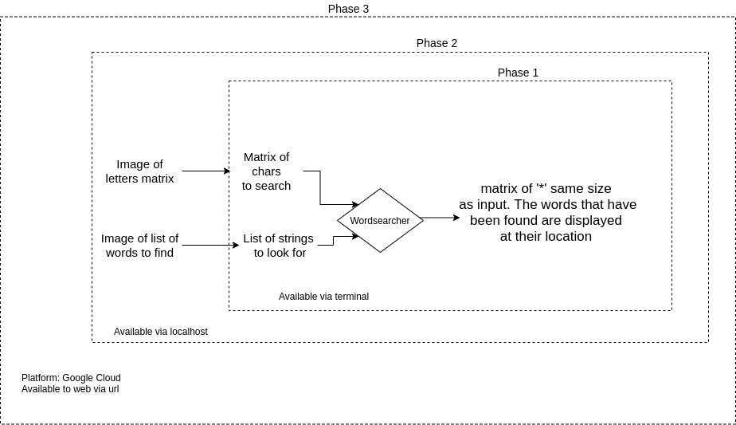

# WordSearcher

A program that is can solve wordsearch puzzles [here is an example](https://thewordsearch.com). 

Note: This project is still under heavy development.

The current plan for the program:

## Descriptions of the planned phases:
### Phase1:

Very much a script to be run in command line at this point, and not very user friendly. 

_Inputs: Arrays_
_Outputs: Arrays_
_where it will run_: Terminal

### Phase 2:
Now the program has some user interface (maybe react?) but runs locally. The program is now more friendly to use, with error messages and prompts. Also, it support images as inputs provided its clear.

_Inputs: Images, Array_
_Outputs: Arrays_
_where it will run_: localhost:8***

### Phase 3:
The program is available on the world wide web. 

_Inputs: Images, Array_
_Outputs: Arrays_ 
_where it will run_: GCP (cloud functions/cloud storage)